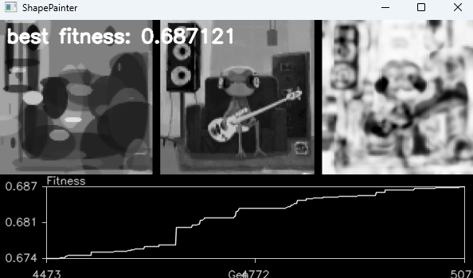
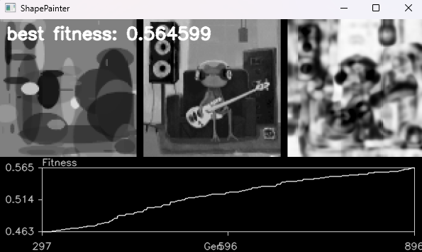
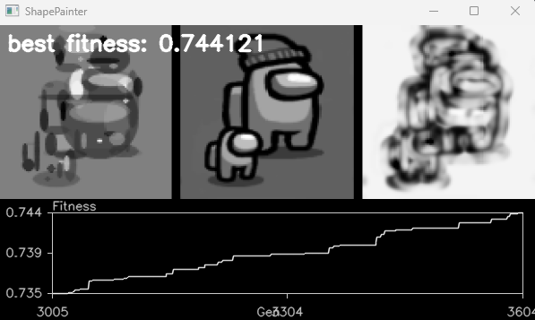

# Shape Painting

An evolutionary algorithm that paints your image out of a fixed handful of
overlapping translucent ellipses, and a live view of it trying.



Left is the best candidate in the population, middle is the target, right is the
SSIM heatmap of where it's still wrong. The plot underneath is best fitness per
generation.

## How it works

An individual is 64 genes, each a 7-value row: size, width/height ratio, x, y,
greyscale colour, opacity, and draw order. Every value is stored 0–1 and mapped
onto real bounds at draw time, so mutation can never produce an invalid shape.
Drawing the genes in draw order gives you the image.

Fitness is SSIM against the target (MSE is in there too if you want it). Each
generation runs a k=2 tournament to pick a third of the population as parents,
makes children by uniform crossover, jitters/respawns/kills a few genes in 30%
of them, and drops them in over everything but the top 1/32.

It's greyscale at the moment — the colour paths are written and commented out in
`src/phenotype.py`.

## Running it

Put a **square** PNG in `data/`. The target gets resized to 100x100 without
preserving aspect ratio, so anything non-square comes out squashed.

```bash
python -m venv .venv
.\.venv\Scripts\activate
pip install -r requirements.txt
```

```bash
python shape-painting.py data/myimage.png
```

Ctrl+C to stop. It'll ask whether to save, and drops the whole population in
`checkpoints/ch_<gen>.npy` if you say yes. Pick it back up with:

```bash
python shape-painting.py data/myimage.png -C checkpoints/ch_5077.npy
```

A checkpoint with the wrong population size gets padded with randoms or
truncated, so you can change `POPULATION_SIZE` between runs. Changing
`max_genes` invalidates it.

## Progress

Fitness climbs quickly and then grinds. Same image, 900 generations against
5,000:

| | |
|---|---|
|  | gen 896, SSIM 0.565 |
|  | gen 5,077, SSIM 0.687 |

Simpler targets get further. Among Us at gen 3,604 is on 0.744:



## Knobs

| | | |
|---|---|---|
| `POPULATION_SIZE` | `src/evolver.py` | 128 |
| `max_genes` | `src/genotype.py` | 64 shapes per painting |
| `pop_rate`, `sigma`, `respawn_rate`, `kill_rate` | `src/selection.py` | mutation rates |
| `method` | `src/evolver.py` | `ssim` or `mse` |

## Layout

| | |
|---|---|
| `src/genotype.py` | the genome |
| `src/phenotype.py` | genes to image |
| `src/fitness.py` | SSIM and MSE |
| `src/evaluate.py` | scores and ranks the population |
| `src/selection.py` | tournament, crossover, mutation |
| `src/evolver.py` | the main loop |
| `src/display.py` | the OpenCV window and fitness plot |
| `testing.ipynb` | scratch |
